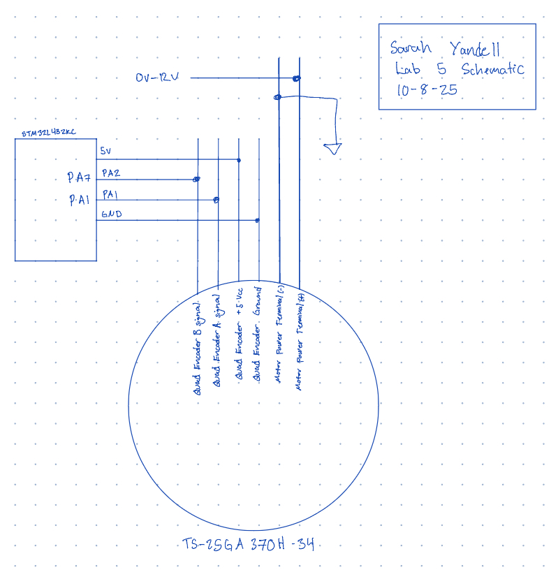
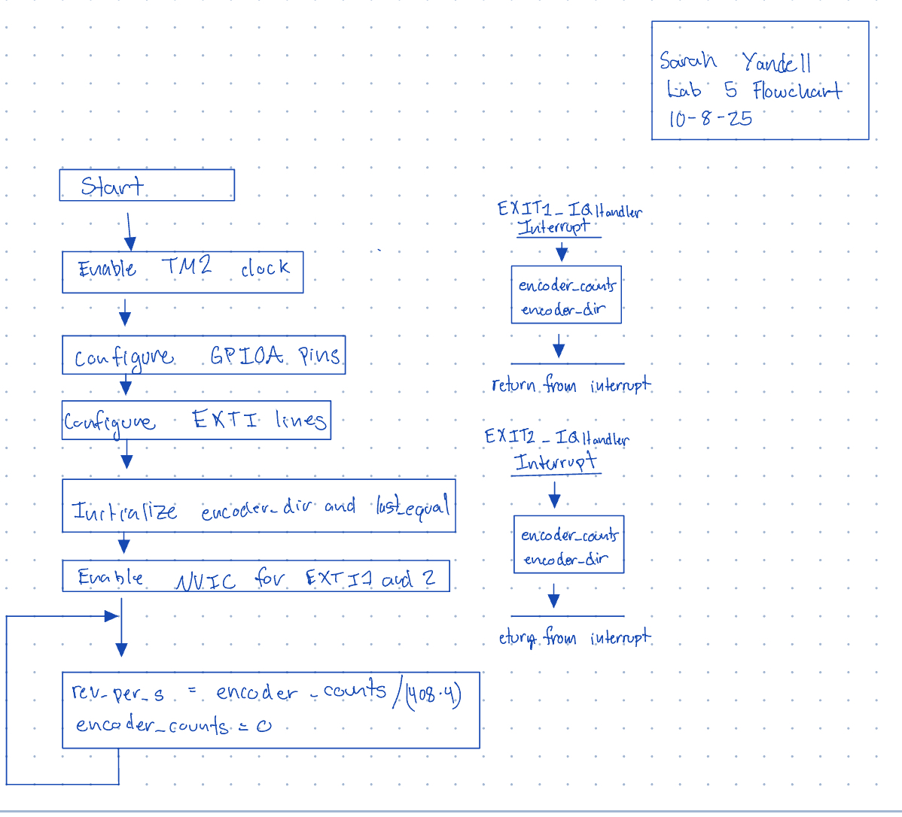

## Lab 5: Interrupts

### Introduction
In this lab, I used the STM32L432KC MCU to read a quadrature encoder via EXTI interrupts on pins PA1 and PA2, 
determine rotation direction, and compute angular velocity. The measured velocity (in revolutions per second) 
and direction are printed at a 1 Hz update rate.

### Design and Testing Methodology
The encoder channels (A and B) were connected to 5 V–tolerant GPIO pins on the STM32L432KC and configured as inputs with 
pull‑ups. External interrupt lines (EXTI1 and EXTI2) were enabled on both rising and falling edges to capture all state 
transitions. Direction is checked only when leaving equal states (00 or 11), and a signed quadrature count accumulates by 
±1 per edge according to the checked direction. A periodic 1sec interval computes the velocity as counts per second divided 
by counts per revolution (×4 for both edges), then resets the interval count. Velocity is positive which CW and negative when CCW.

Verification was done by running the code and timing till 30 rotation manually. Then checking if the speeds matched.

### Technical Documentation
The source code for the project can be found in the associated [Github repository](https://github.com/sxyandell/e155-lab5).

#### Schematic
Figure 1 shows the wiring for the encoder channels to the MCU. The pins used were 5 V–tolerant and the motor 
was powered by a extermal power supply that was changed between 0V - 12V. 

#### Flowchart
Figure 2 shows the main steps of the program and function calls.

### Results and Discussion
The system successfully met the lab requirements: direction was correctly 
decoded, and velocity was accurately displayed across both low and high speeds.
 Using the motor’s COUNTS_PER_REV value of 408, we determined that at 10 V, 
 the motor’s speed was approximately 2.5 rev/s, which aligns with the expected 
 performance. The system functioned correctly for both clockwise (CW) and 
 counterclockwise (CCW) rotation.

#### Polling 
I found the frequency of my code while using interupts at 10V using an oscilloscope, and frequency is 1khz. This meaans that the speed is 1000/408 = 2.45 rev/sec.
Then I made code that toggled a pin in a while loop in main. The idea behind this was the fastest the MCU do polling is this speed. I found
the frequency was 549hz which is 1.35 rev/sec. So the polling would miss edges since it is not able to sample as fast.

### Conclusion
An EXTI‑based quadrature decoder was implemented on the STM32L432KC that measured direction and angular velocity 
and reported results at 1 Hz. The approach performed reliably across a range of speeds. I spent approximately 15 hours completing this lab.

### AI Prototype Summary

I put the promopt into the LMM and it gave me back code that using a library called Hardware Abstraction Layer (HAL) library for GPIO. The library was
aimed to make coding GPIO eaasier but since I would have to odownload and get the library working I requested that the LLM make code without using 
the library. Then it gave me this code:

volatile int32_t encoder_count = 0;
volatile uint8_t last_state = 0;

static inline uint8_t read_encoder_state(void) {
    uint8_t a = (GPIOA->IDR & (1 << 0)) ? 1 : 0;
    uint8_t b = (GPIOA->IDR & (1 << 1)) ? 1 : 0;
    return (a << 1) | b;
}

void Encoder_Init(void) {
    // 1. Enable GPIOA and SYSCFG clocks
    RCC->AHB2ENR |= RCC_AHB2ENR_GPIOAEN;
    RCC->APB2ENR |= RCC_APB2ENR_SYSCFGEN;

    // 2. Configure PA0 and PA1 as inputs
    GPIOA->MODER &= ~((3 << (0 * 2)) | (3 << (1 * 2)));  // 00 = input

    // 3. Connect EXTI0 and EXTI1 lines to PA0 and PA1
    SYSCFG->EXTICR[0] &= ~((0xF << 0) | (0xF << 4));     // EXTI0->PA0, EXTI1->PA1

    // 4. Configure both edges to trigger interrupts
    EXTI->RTSR1 |= (1 << 0) | (1 << 1);   // Rising edge
    EXTI->FTSR1 |= (1 << 0) | (1 << 1);   // Falling edge

    // 5. Unmask EXTI0 and EXTI1 interrupts
    EXTI->IMR1 |= (1 << 0) | (1 << 1);

    // 6. Enable NVIC IRQs for EXTI0 and EXTI1
    NVIC_SetPriority(EXTI0_IRQn, 1);
    NVIC_EnableIRQ(EXTI0_IRQn);
    NVIC_SetPriority(EXTI1_IRQn, 1);
    NVIC_EnableIRQ(EXTI1_IRQn);

    // 7. Record initial state
    last_state = read_encoder_state();
}

// --- Interrupt Handlers ---

void EXTI0_IRQHandler(void) {
    if (EXTI->PR1 & (1 << 0)) {   // check if EXTI0 triggered
        EXTI->PR1 = (1 << 0);     // clear pending bit
        uint8_t state = read_encoder_state();

        // Decode direction
        if ((last_state == 0b00 && state == 0b01) ||
            (last_state == 0b01 && state == 0b11) ||
            (last_state == 0b11 && state == 0b10) ||
            (last_state == 0b10 && state == 0b00)) {
            encoder_count++;
        } else if (
            (last_state == 0b00 && state == 0b10) ||
            (last_state == 0b10 && state == 0b11) ||
            (last_state == 0b11 && state == 0b01) ||
            (last_state == 0b01 && state == 0b00)) {
            encoder_count--;
        }

        last_state = state;
    }
}

void EXTI1_IRQHandler(void) {
    if (EXTI->PR1 & (1 << 1)) {   // check if EXTI1 triggered
        EXTI->PR1 = (1 << 1);     // clear pending bit
        uint8_t state = read_encoder_state();

        // Same direction decoding
        if ((last_state == 0b00 && state == 0b01) ||
            (last_state == 0b01 && state == 0b11) ||
            (last_state == 0b11 && state == 0b10) ||
            (last_state == 0b10 && state == 0b00)) {
            encoder_count++;
        } else if (
            (last_state == 0b00 && state == 0b10) ||
            (last_state == 0b10 && state == 0b11) ||
            (last_state == 0b11 && state == 0b01) ||
            (last_state == 0b01 && state == 0b00)) {
            encoder_count--;
        }

        last_state = state;
    }
}

I ran this with my main function and it did not print any values. I think that the code that the LLM writes looks nice and some of the 
ways it did things were cool but all together it does not work very well. I think that the LLM is better as a sounding board than at writing stright code.

